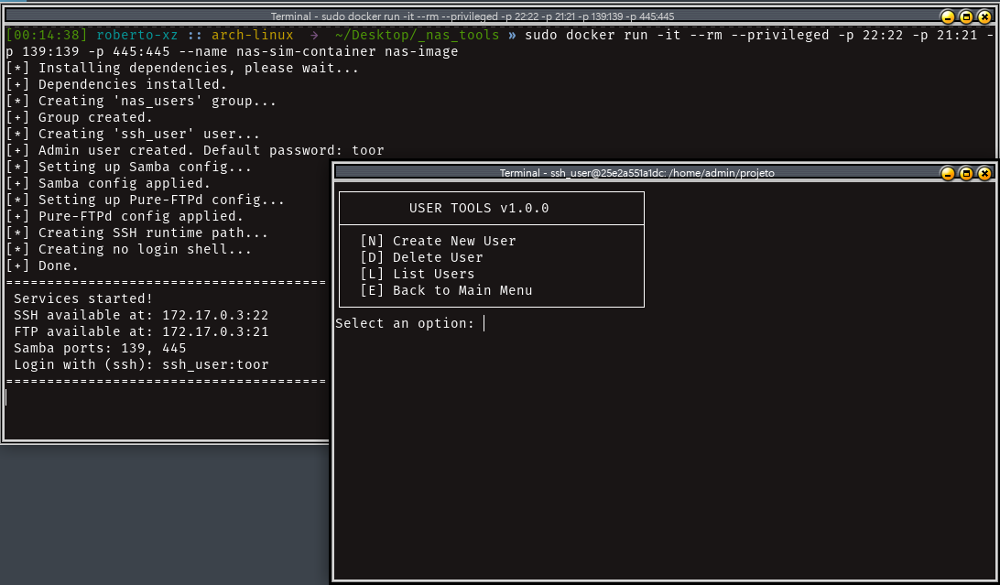

# 🗄️ Virtualização de um Serviço NAS

Este projeto simula um ambiente NAS (Network Attached Storage) utilizando Docker e Bash.  
Discos são virtualizados como arquivos, organizados em RAID com `mdadm`, e disponibilizados via **FTP**, **SMB** e **SSH** — tudo acessado por um menu interativo.

---



---

## ⚙️ Funcionalidades

- Criação de discos virtuais usando arquivos  
- Montagem como loop devices  
- Organização em arrays RAID (RAID 0, 1, 5, 10 etc.) com `mdadm`  
- Criação de volumes e usuários  
- Compartilhamento dos volumes via:  
  - **FTP** (pure-ftpd)  
  - **SMB** (Samba)  
  - **SSH** (acesso à interface de controle via terminal)  

---

## 🛠️ Tecnologias utilizadas

- Bash Script  
- Docker  
- Loop Devices  
- mdadm  
- pure-ftpd  
- Samba  
- OpenSSH  

---

## 🚀 Como rodar

### 1️⃣ Construir a imagem Docker

```bash
sudo docker build -t nas-image .
```

### 2️⃣ Executar o container

```bash
sudo docker run -it --rm --privileged \
  -p 22:22 -p 21:21 -p 139:139 -p 445:445 \
  nas-image
```

> ⚠️ `--privileged` é obrigatório para usar loop devices e RAID dentro do container.

---

## 🧑‍💻 Como usar

1. Conecte-se ao container via **SSH**:

```bash
ssh ssh_user@localhost -p 22
```

2. Navegue até o diretório do projeto:

```bash
cd /home/admin/projeto
```

3. Inicie o menu interativo:

```bash
sudo ./app.sh
```

> No menu, você poderá criar usuários, volumes, escolher o tipo de RAID e número de discos, além de visualizar o status dos serviços e arrays.

---

## 📁 Organização dos volumes

Os volumes criados são montados automaticamente e acessíveis via:

- **FTP** – porta 21  
- **SMB** – portas 139 e 445  
- **SSH** – porta 22  

---

## 📄 Licença

Projeto desenvolvido para fins acadêmicos.  
**Sem licença de distribuição.**
